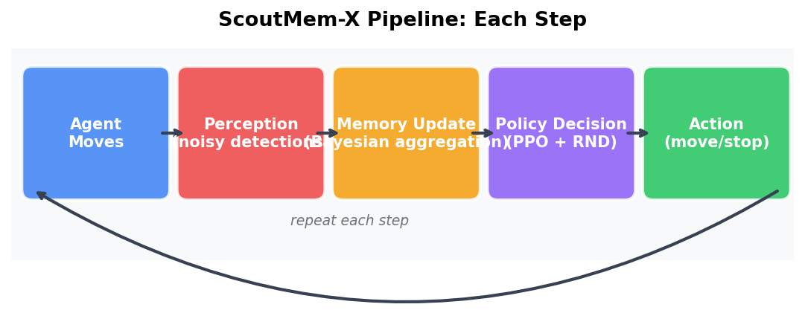
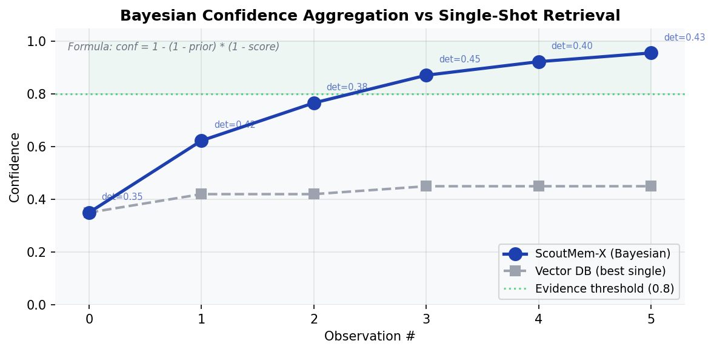
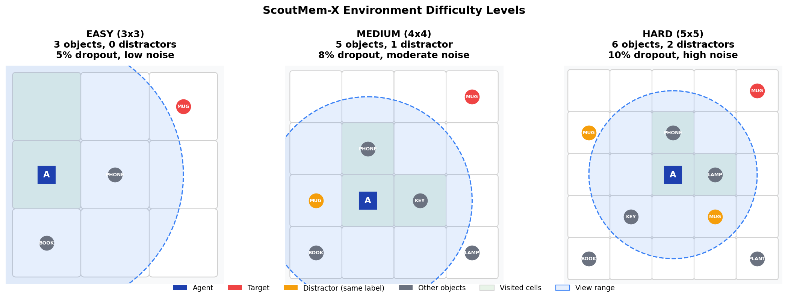
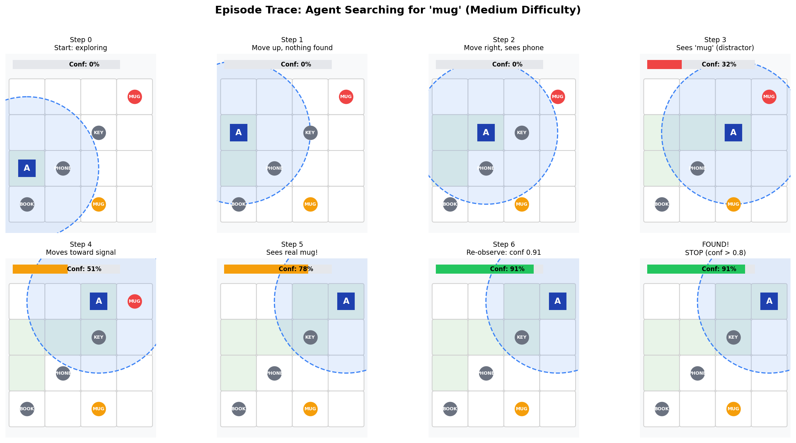

# ScoutMem-X

**Probabilistic scene memory for embodied object search under partial observability.**

ScoutMem-X is an embodied AI agent that searches for objects in environments where it can't see everything and its perception is noisy. Instead of storing a single detection like a vector database (FAISS, ChromaDB), it watches objects from multiple angles and mathematically combines each observation into a growing confidence score using Bayesian inference.

<p align="center">
  
</p>

## The Problem with Vector Databases

Standard retrieval systems see an object once, store one embedding, and retrieve it later. Under noisy perception, that single detection might be 40% confident -- a coin flip. If it was a false positive, that bad embedding lives in your database forever.

ScoutMem-X fixes this by accumulating evidence:

<p align="center">
  
</p>

The core formula: `new_confidence = 1 - (1 - prior) * (1 - new_score)`

Six noisy detections (each ~0.35-0.45) combine to **0.95+ confidence**. A vector DB stays stuck at 0.45 (best single score). This is the same math used in sensor fusion, medical diagnostics, and spam filtering.

| Problem | Vector DB | ScoutMem-X |
|---------|-----------|------------|
| Noisy detection (conf=0.3) | Stored as-is | Aggregated: 0.58 after second view |
| False positive | Stored permanently | Decays over time if not re-observed |
| Multiple candidates | Returns nearest embedding | Tracks all, highest cumulative confidence wins |
| Partial observability | No exploration strategy | RL policy learns where to look next |

## The Environment

The agent operates in a grid world with objects, distractors (objects sharing the target's label), limited view range, perception dropout (detections randomly fail), and noise. Three difficulty levels scale up the challenge:

<p align="center">
  
</p>

| | Easy | Medium | Hard |
|--|:----:|:------:|:----:|
| **Grid** | 3x3 (9 cells) | 4x4 (16 cells) | 5x5 (25 cells) |
| **Objects** | 3 | 5 | 6 |
| **Distractors** | 0 | 1 (shares target label) | 2 (share target label) |
| **Dropout** | 5% (detections rarely fail) | 8% | 10% (1 in 10 detections lost) |
| **Noise** | Low (std=0.03) | Moderate (std=0.05) | High (std=0.06) |
| **Max steps** | 15 | 20 | 25 |
| **RL success** | **94%** | **71%** | **56%** |

**Easy** is a small room with a few clearly distinct objects -- the agent solves it almost every time. **Hard** is a large space with distractors that look like the target, frequent detection failures, and noisy confidence scores. The agent must explore strategically, accumulate evidence from multiple views, and decide when it has enough confidence to stop.

## How the Agent Searches

Here's an actual episode showing the agent searching for a "mug" in a medium environment:

<p align="center">
  
</p>

The agent starts exploring (steps 0-2), encounters a distractor mug (step 3, confidence 32%), moves toward the signal (step 4, 51%), finds the real target (step 5, 78%), re-observes to build confidence (step 6, 91%), and stops once evidence crosses the threshold.

Key behaviors the RL policy learned:
- **Systematic coverage**: visits unsearched quadrants rather than backtracking
- **Signal following**: moves toward detected candidates to re-observe them
- **Evidence sufficiency**: stops only when confidence exceeds 0.8 (not on first detection)
- **Distractor rejection**: builds higher confidence on the true target through repeated observation

## Results

### ScoutMem-X vs Baselines (Hard, 5x5 Grid)

<p align="center">
  
</p>

| Method | Success Rate | Avg Steps |
|--------|:-----------:|:---------:|
| FAISS Vector DB | 34.0% | 14.5 |
| Random + ScoutMem | 26.7% | 25.0 |
| Rule-based + ScoutMem | 47.0% | 5.7 |
| RL + ScoutMem (5 seeds) | 48.6% +/- 4.5% | 8.1 |
| RL + Curriculum | 52.0% | 7.8 |
| RL + Domain Rand | 53.0% | 6.5 |
| **RL + RND (curiosity)** | **56.0%** | **8.0** |

Best vs FAISS: **+22 percentage points** (65% relative improvement).

### Difficulty Scaling

<p align="center">
  
</p>

The agent achieves 94% on easy (3x3), 71% on medium (4x4), and 56% on hard (5x5). Performance degrades gracefully as the environment gets larger and noisier.

### Multi-Seed Reproducibility (5 seeds, 300K steps)

<p align="center">
  
</p>

### Real Perception (GroundingDINO)

Running a real open-vocabulary object detector on actual images:
- Vector DB best single detection: **0.538**
- ScoutMem-X after 5 observations: **1.000**
- **86% improvement** -- from a coin flip to certainty

### Ablation Study (5 seeds, 300K steps)

<p align="center">
  
</p>

All RL variants (~47-52%) significantly outperform random exploration (31%). The system-level combination of RL + Bayesian memory is the primary driver -- no single component accounts for the gap alone.

## Technical Enhancements

| Technique | What It Does | Effect |
|-----------|-------------|--------|
| **Frame stacking** | 4-frame history (64-dim input) gives the policy temporal context | Handles POMDP -- same cell, different exploration history |
| **Curriculum learning** | Train easy -> medium -> hard, carrying the model forward | +3.4pp over baseline |
| **Domain randomization** | Vary grid size, noise, objects per episode | +4.4pp, fastest exploration (6.5 steps) |
| **RND intrinsic rewards** | Curiosity bonus for visiting novel states (Burda et al. 2018) | +7.4pp, best overall (56%) |
| **Bounded rewards** | [-1.5, +1.0] range for stable value learning | Fixed 5 prior reward iteration failures |
| **Temporal decay** | Old unverified memories lose confidence over time | Handles false positives and moved objects |

## Related Work

| System | Venue | Gap ScoutMem-X Fills |
|--------|-------|---------------------|
| FindingDory | ICLR 2026 | Shows GPT-4o fails at embodied memory -- we provide a structured Bayesian solution |
| DynaMem | ICRA 2025 | Dynamic memory but no uncertainty tracking -- we add Bayesian confidence |
| ConceptGraphs | ICRA 2024 | Offline/frozen scene graphs -- we do online updates with temporal decay |
| MemoryExplorer | CVPR 2026 | Shares the RL + memory exploration paradigm |

## Quick Start

```bash
# Install
pip install -e ".[rl]"

# Train on easy (validates convergence in ~2 min)
python -m scoutmem_x.rl.train --difficulty easy --timesteps 100000

# Train with curriculum (easy -> medium -> hard)
python -m scoutmem_x.rl.train --curriculum --timesteps 500000

# Train with RND curiosity rewards (best results)
python -m scoutmem_x.rl.rnd --timesteps 300000

# Run comparison: RL vs FAISS vs baselines
python -m scoutmem_x.rl.compare --episodes 200

# Multi-seed evaluation (5 seeds, mean +/- std)
python -m scoutmem_x.rl.evaluate --seeds 0,1000,2000,3000,4000 --difficulty hard

# Ablation study (6 conditions x 5 seeds)
python -m scoutmem_x.rl.ablation --timesteps 300000

# Generate all figures
python -m scoutmem_x.rl.visualize
python -m scoutmem_x.rl.demo_visuals

# Real perception demo (requires: pip install transformers torch pillow)
python -m scoutmem_x.demo.real_perception --images path/to/photos/ --target "mug"

# Run tests (48 tests)
python -m pytest tests/ -v
```

## Project Structure

```
src/scoutmem_x/
  env/          # Grid world environments, Observation dataclass
  perception/   # Swappable adapters: Mock, Oracle, GroundingDINO
  memory/       # Bayesian confidence aggregation, temporal decay, retrieval
  policy/       # Reactive, passive memory, active evidence policies
  rl/           # PPO training, curriculum, domain rand, RND, ablation, evaluation
  demo/         # Real perception pipeline (GroundingDINO + ScoutMem)
  stress/       # Perturbation testing (dropout, false positives, score decay)
tests/          # 48 tests
figures/        # All visualizations
```

## Requirements

Python 3.10+, gymnasium, stable-baselines3, numpy, faiss-cpu. See `pyproject.toml` for full details.
