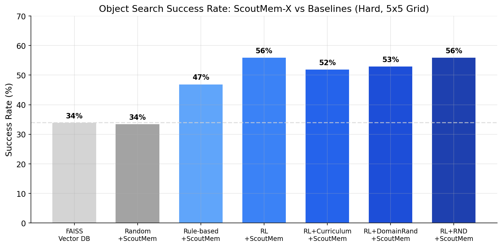
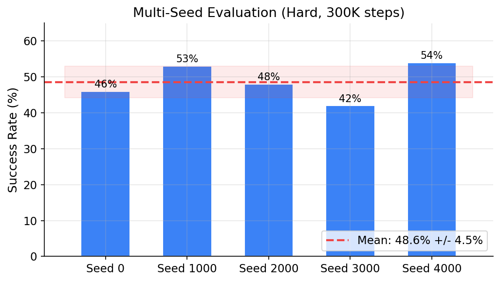
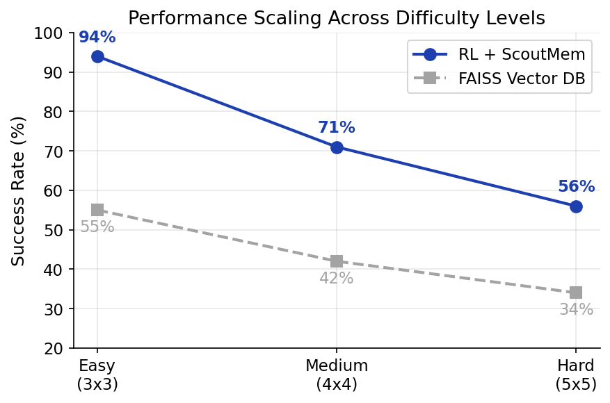
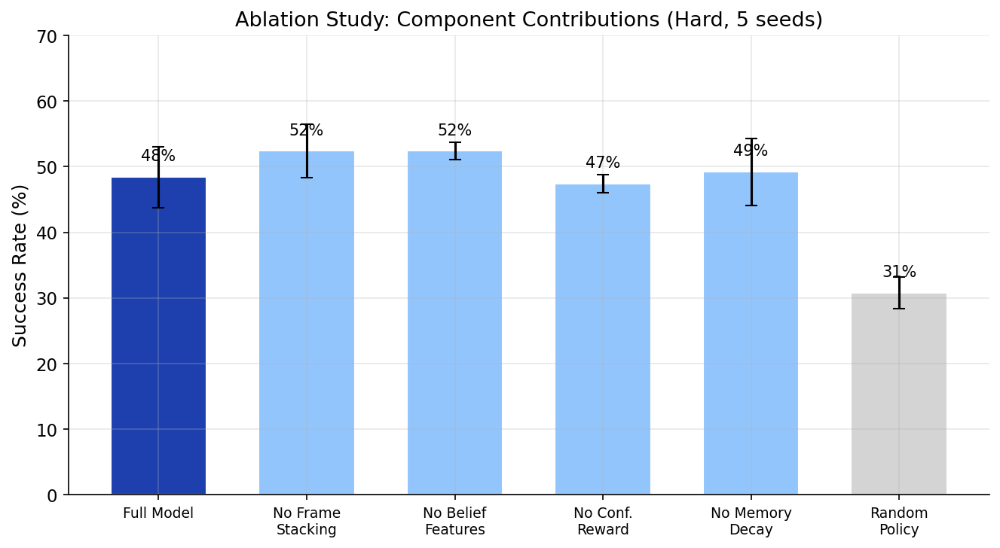

# ScoutMem-X

**Probabilistic scene memory for embodied object search under partial observability.**

ScoutMem-X is an embodied AI system where an agent navigates environments to find target objects using noisy perception. Unlike standard vector database retrieval (FAISS, ChromaDB) which stores single-shot embeddings, ScoutMem-X aggregates evidence across multiple observations using Bayesian confidence updates, temporal decay, and RL-trained exploration policies.

**Result: 56% success rate on hard environments vs 34% for FAISS vector DB retrieval (+22 percentage points).**

<p align="center">
  
</p>

## Why Not Just Use a Vector Database?

Standard retrieval systems store one embedding per detection and retrieve by similarity. This breaks under noisy, partial observability:

| Problem | Vector DB | ScoutMem-X |
|---------|-----------|------------|
| Noisy detection (conf=0.3) | Stored as-is, retrieved as-is | Aggregated: `1-(1-0.3)(1-0.4) = 0.58` after second view |
| False positive | Stored permanently | Decays over time if not re-observed |
| Multiple candidates | Returns nearest embedding | Tracks all candidates, highest cumulative confidence wins |
| Partial observability | No exploration strategy | RL policy learns where to look next |

The core confidence update: `new_conf = 1 - (1 - prior) * (1 - score)`

Each re-observation multiplicatively reduces uncertainty. After 3 noisy observations (0.3, 0.4, 0.35), confidence reaches 0.73 -- impossible with single-shot retrieval.

## Architecture

```
Agent moves -> Perceives (noisy) -> Updates memory (Bayesian) -> Policy decides -> Repeat
```

- **Perception**: Swappable adapters via Protocol interface (mock, oracle, GroundingDINO)
- **Memory**: `MemoryNode` graph with Bayesian confidence aggregation + temporal decay
- **Policy**: PPO-trained exploration with 64-dim observation (4-frame stack x 16 belief features)
- **Environment**: Gymnasium env with configurable difficulty (3x3 to 5x5 grids, adjustable noise/dropout)

### Observation Space (16 dims per frame)

| Dims | Feature | Purpose |
|------|---------|---------|
| 0-1 | Agent position (normalized) | Where am I? |
| 2 | Target confidence | How sure am I? |
| 3-4 | Direction to best candidate | Where should I go? |
| 5 | Coverage (fraction visited) | How much have I explored? |
| 6 | Time remaining | How urgent is this? |
| 7 | Candidate count | How many possibilities exist? |
| 8-9 | Direction to nearest unvisited | Where to explore next? |
| 10-13 | Quadrant coverage (NW/NE/SW/SE) | Which areas are unsearched? |
| 14 | Steps since confidence gain | Is exploring still productive? |
| 15 | Max confidence ever seen | Prevents forgetting found targets |

Frame stacking (4 frames) gives the policy temporal history to handle the POMDP.

## Results

### Comparison: ScoutMem-X vs Baselines (Hard, 5x5 Grid)

| Method | Success Rate | Avg Steps |
|--------|:-----------:|:---------:|
| FAISS Vector DB | 34.0% | 14.5 |
| Random + ScoutMem | 26.7% | 25.0 |
| Rule-based + ScoutMem | 47.0% | 5.7 |
| RL + ScoutMem | 48.6% +/- 4.5% | 8.1 |
| RL + Curriculum | 52.0% | 7.8 |
| RL + Domain Rand | 53.0% | 6.5 |
| **RL + RND** | **56.0%** | **8.0** |

### Multi-Seed Reproducibility (5 seeds, 300K steps)

<p align="center">
  
</p>

### Difficulty Scaling

| Difficulty | Grid | Objects | Distractors | Success |
|-----------|:----:|:-------:|:-----------:|:-------:|
| Easy | 3x3 | 3 | 0 | 94% |
| Medium | 4x4 | 5 | 1 | 71% |
| Hard | 5x5 | 6 | 2 | 56% |

<p align="center">
  
</p>

### Ablation Study (300K steps, 3 seeds)

<p align="center">
  
</p>

All RL variants (~49-53%) significantly outperform random exploration (27%). The system-level combination of RL + Bayesian memory is the primary driver of performance.

## Technical Enhancements

| Technique | Implementation | Effect |
|-----------|---------------|--------|
| **Frame stacking** | 4-frame deque, 64-dim MLP input | Handles POMDP (same state, different history) |
| **Curriculum learning** | Sequential easy->medium->hard with model transfer | +3.4pp over baseline |
| **Domain randomization** | Randomize grid size, noise, objects per episode | +4.4pp, fastest exploration (6.5 steps) |
| **RND intrinsic rewards** | Burda et al. 2018, curiosity bonus for novel states | +7.4pp, best overall (56%) |
| **Bounded rewards** | [-1.5, +1.0] range for stable value learning | Fixed 5 prior reward iteration failures |

## Related Work

ScoutMem-X addresses gaps in existing embodied memory systems:

| System | Venue | Gap ScoutMem-X Fills |
|--------|-------|---------------------|
| FindingDory | ICLR 2026 | Shows GPT-4o fails at embodied memory -- we provide a structured solution |
| DynaMem | ICRA 2025 | Dynamic memory but no uncertainty tracking -- we add Bayesian confidence |
| ConceptGraphs | ICRA 2024 | Offline/frozen scene graphs -- we do online updates with temporal decay |
| MemoryExplorer | CVPR 2026 | Shares the RL + memory exploration paradigm |

## Quick Start

```bash
# Install
pip install -e ".[rl]"

# Train (easy first to validate)
python -m scoutmem_x.rl.train --difficulty easy --timesteps 100000

# Train with curriculum (easy -> medium -> hard)
python -m scoutmem_x.rl.train --curriculum --timesteps 500000

# Train with RND curiosity rewards
python -m scoutmem_x.rl.rnd --timesteps 300000

# Run comparison experiment
python -m scoutmem_x.rl.compare --episodes 200

# Multi-seed evaluation
python -m scoutmem_x.rl.evaluate --seeds 0,1000,2000,3000,4000 --difficulty hard

# Ablation study
python -m scoutmem_x.rl.ablation --timesteps 300000

# Generate figures
python -m scoutmem_x.rl.visualize

# Run tests
python -m pytest tests/ -v
```

## Project Structure

```
src/scoutmem_x/
  env/          # Grid world environments, Observation dataclass
  perception/   # Swappable adapters: Mock, Oracle, GroundingDINO
  memory/       # Bayesian confidence aggregation, temporal decay, retrieval
  policy/       # Reactive, passive memory, active evidence policies
  rl/           # PPO training, curriculum, domain rand, RND, ablation, evaluation
  stress/       # Perturbation testing (dropout, false positives, score decay)
tests/          # 48 tests covering env, memory, policy, RL components
figures/        # Publication-quality result visualizations
```

## Requirements

Python 3.10+, gymnasium, stable-baselines3, numpy, faiss-cpu. See `pyproject.toml` for full details.
